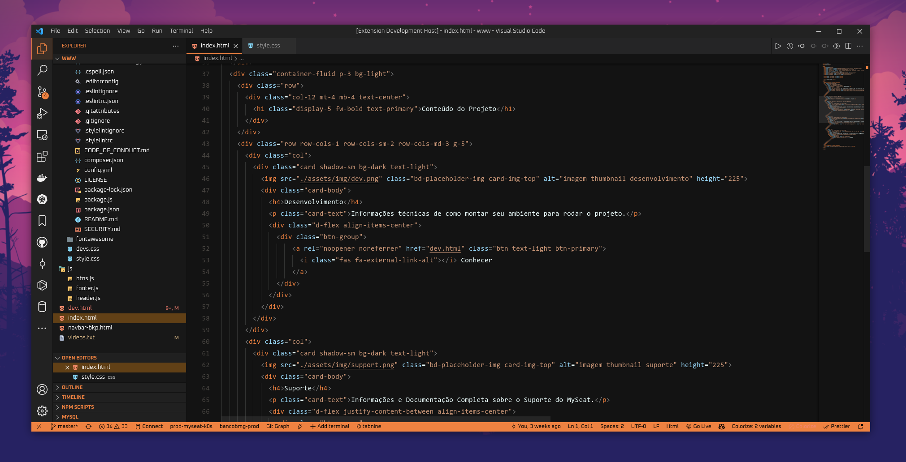
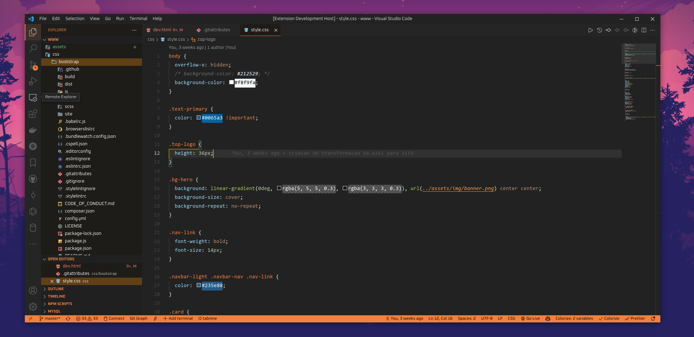
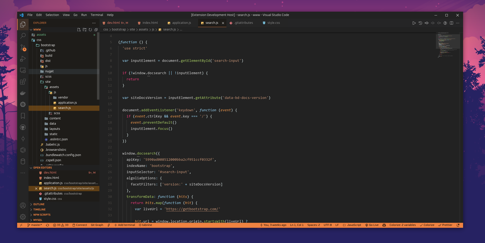
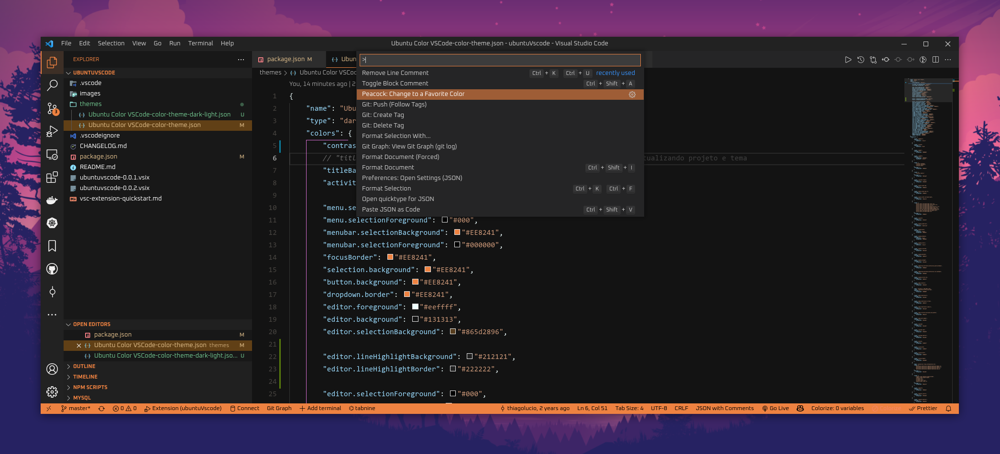

# Ubuntu VSCode Official Canonical Theme Color

  <h3><a href="https://thiagolucio.com.br">Created by Thiago Lúcio Bittencourt</a></h3>
   
  <a href="https://marketplace.visualstudio.com/items?itemName=ThiagoLcioBittencourt.ubuntuvscode">VSCode MarketPlace</a>
   
  <h3>Two different background contrast theme colors</h3>

 

  

  

## CSS/ SCSS Screen

  
  

## JSON Screen

  

## JavaScript Screen

  

## Settings menu

  <h3>Setting menu Screen</h3>
  

### For more information

* [Thiago Lúcio Bittencourt Site](https://thiagolucio.com.br/)
* [Thiago Lúcio Bittencourt VSCode Profile](https://marketplace.visualstudio.com/manage/publishers/thiagolciobittencourt)

**Enjoy!**
